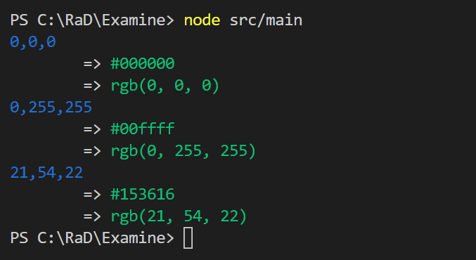

# An exercise in TS Constructor Interfaces
This is a simple exercise in how to use constructor interfaces to guide implementers of interchangeable behaviors.  This is primarily useful for decomposing code into units that are easy to test.

When describing a class using interfaces, you break it up into two parts:
* an interface that describes the _static_ side, including the _constructor_: [`IColorStatic`](src/icolorstatic.ts)
* an interface that describes the _instance_ side, meaning what is returned from `new`-ing it up [`IColor`](src/icolor.ts)

Anders' comment [here](https://github.com/Microsoft/TypeScript/issues/8917#issuecomment-223045379) clarified it for me.

To illustrate, this contrived example demonstrates how to build a set of RGB color translators, so you can easily output something like the following:

### To Run:
1. `npm install`
1. `tsc`
1. `node src/main`

